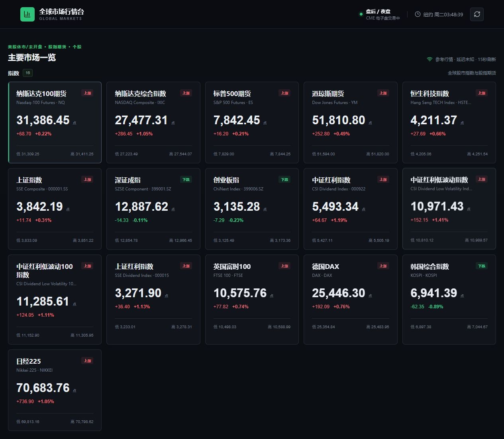
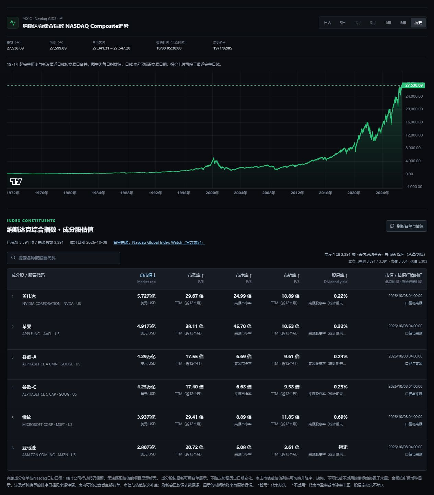
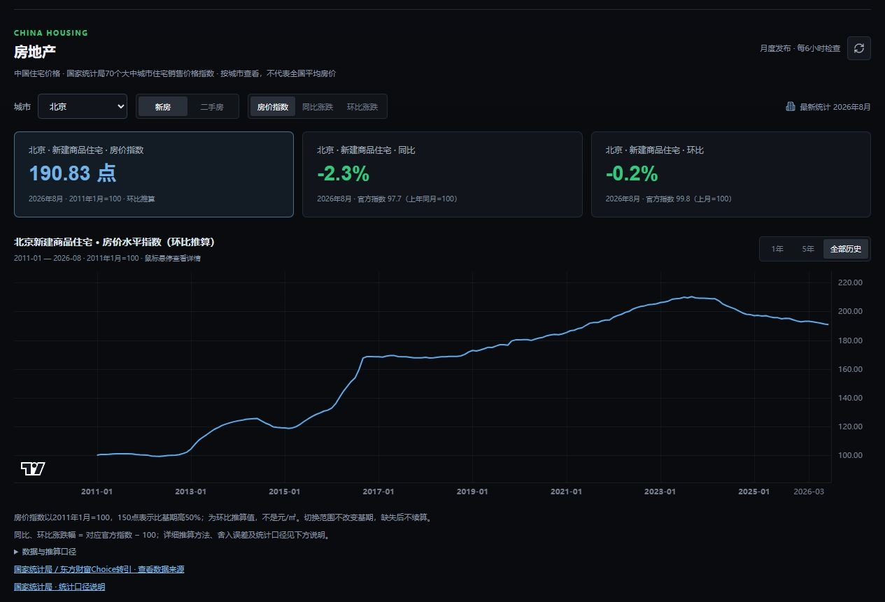
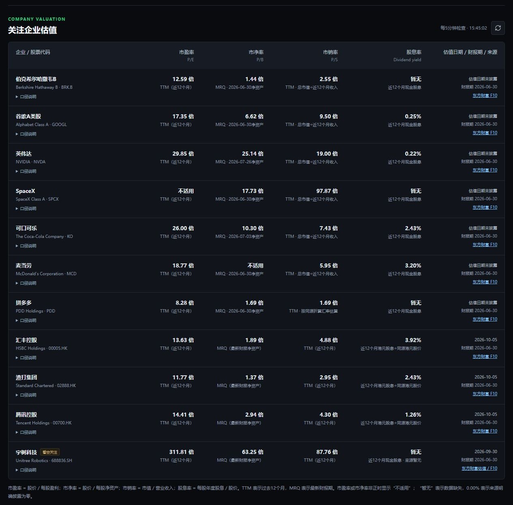

# 全球市场行情台

自动刷新纳斯达克100、标普500和道琼斯 E-mini 期货、纳斯达克综合指数、伯克希尔、谷歌、英伟达（NVDA / NVIDIA）、苹果（AAPL / Apple）、SpaceX、可口可乐（KO / The Coca-Cola Company）、麦当劳（MCD / McDonald's Corporation）、上证指数、深证成指、创业板指、英国富时100、德国DAX、韩国综合指数、日经225及伦敦现货金行情。美股正盘时显示纳斯达克100、标普500、道琼斯现金指数；正盘外切换为对应股指期货。趋势图支持日内、5日、1月、3月、1年、5年和历史全量；全球指数历史从各自数据文件记录的最早交易日起算。黄金支持美元/盎司与人民币/克切换。

远程仓库：[Mavericks2019/market-dashboard](https://github.com/Mavericks2019/market-dashboard)。

## 界面预览

以下截图用于展示界面，数值以截图时刻为准；最新数据日期、来源及连接状态以网页标注为准。

### 指数总览



### 指数全历史与完整成分股



### 房价水平指数



### 关注企业估值



## 功能与数据

报价与历史走势分别加载：报价通常每15秒刷新，只请求当前所选市场的历史，避免反复传输所有指数的完整日线。慢数据源独立更新，刷新失败保留最近有效数据及其原始报价时间；卡片和图表展示的是来源报价时间，不把网页刷新时间当成交易时间。刷新报价不会重置图表的鼠标缩放或拖动位置。

成分股仍可查看和搜索全部记录，长表仅渲染可视区域附近的行，滚动即可查看其余记录。成分股估值缓存为60秒，点击“刷新名单与估值”会重新请求名单和估值；下方关注企业表的手动刷新也会绕过估值缓存。报价延迟、休市及日更数据按来源时间识别，不承诺交易所级实时行情。

两个估值表均可点击指标表头切换降序与升序；成分股还支持总市值排序，排序作用于完整名单。箭头表示当前方向，缺失值及不适用的市盈率/市净率在两个方向下均放在末尾，0股息率正常参与排序。

另提供 CFETS 人民币汇率指数和在岸人民币兑美元汇率。汇率默认显示 `CNY/USD`（1 人民币可兑换多少美元），点击该卡片后，可在走势图上方切换到 `USD/CNY`（1 美元可兑换多少人民币）。切换会同步换算报价、历史曲线、高低价与涨跌幅。

行情卡片从上到下依次为“指数”“基金ETF”“个股”“货币”：全球股市指数和股指期货归入指数，场内交易基金归入基金ETF，关注的上市企业归入个股，人民币汇率、CFETS 汇率指数与黄金归入货币。企业估值表保留在走势图下方。

“基金ETF”包含南方红利低波50ETF `515450.SH`（Southern Dividend Low Volatility 50 ETF），全称为南方标普中国A股大盘红利低波50交易型开放式指数证券投资基金，跟踪标普中国A股大盘红利低波50指数。根据[南方基金中期报告](https://www.nffund.com/main/files/2025/08/29/742118389604.pdf)，基金成立于2020-01-17、在上海证券交易所上市于2020-02-26；[基金产品页](https://www.nffund.com/new/personal-financing/detail.html?fundCode=515450)提供官方产品资料。平台展示人民币/份的场内成交价格，保留3位小数，支持15秒刷新、日内/5日分时和上市以来的全部可用日线，默认一次展开全历史。该价格与基金净值、标的指数点位分别属于不同口径；不复权价格曲线不包含现金分红再投资收益。

“基金 / ETF”还包含场外的南方标普红利低波50ETF联接A `008163`（Southern Dividend Low Volatility 50 ETF Feeder A）。联接A展示每日公布的单位净值，保留4位小数，历史始于2020-01-21；净值日期、前期净值和净值日变化单独标注，不显示盘中交易价格。场内ETF和场外联接A的净值、分红记录分别获取，避免混用。[联接A产品资料](https://www.nffund.com/new/personal-financing/detail.html?fundCode=008163)及[实际分红记录](https://fundf10.eastmoney.com/fhsp_008163.html)可用于核对；总回报按实际派息计算，不预设每月必然分红。

选择上述任一基金后，价格或单位净值图旁边同时显示“红利再投资总回报”图，手机上上下排列。总回报默认展开各基金成立以来全部可用历史，并可独立切换1月、3月、1年和5年，鼠标悬停查看日期与收益。数据来自天天基金的基金净值及分红记录，按日更新，显示最新净值日期；并非盘中实时总回报。

总回报以首个净值日为100，按 `本日总回报指数 = 前日总回报指数 × (本日单位净值 + 本日每份现金分红) / 前日单位净值` 逐日复利计算，分红计入除息日。累计净值仅用于交叉校验分红金额，不直接用作总回报。这是假设分红立即按除息日净值再投资的理论测算，基金运作费已体现在净值中，不包含个人交易费用。场内ETF的[基金分红公告](https://www.sse.com.cn/disclosure/fund/announcement/c/new/2024-12-12/515450_20241212_LFDQ.pdf)规定现金分红，实际到账后按场内成交价买入会与该曲线不同；场外联接可选择红利再投资，实际账户仍受买入时点、费用等因素影响。接口为 `GET /api/etf-total-return?key=NF_DIV_LV50`（场内ETF）或 `key=NF_DIV_LV50_A`（场外联接A）；净值源异常时保留各基金可用缓存并标明状态，不用价格曲线代替总回报。

“指数”板块包含中证红利 `000922`（CSI Dividend Index）、中证红利低波动 `H30269`（CSI Dividend Low Volatility Index）、中证红利低波动100 `930955`（CSI Dividend Low Volatility 100 Index）和上证红利 `000015`（SSE Dividend Index）。四者均为价格指数，单位为点；默认“历史”视图展示全部可用日线，可用鼠标缩放、移动并查看具体日期的数值。

另加入纳斯达克中国金龙指数 `HXC`（Nasdaq Golden Dragon China Index），跟踪在美国上市、主要业务位于中国的企业。点击默认展开全部可用历史，支持分时、5日及不同历史区间。[Nasdaq官方资料](https://indexes.nasdaqomx.com/Index/Overview/HXC)给出基日2003-09-30、基值2500点；当前官方公开日线实际从2004-12-06开始，未取得的早期记录不补造。日线使用Nasdaq价格指数，分时/报价来自东方财富 `251.HXC`，新浪备用代码为 `$hxc`；不混用同名股票或总回报指数HXCX。

点击股票指数或股指期货后，走势图下方显示对应指数的全部成分股，以及总市值、市盈率、市净率、市销率和股息率。默认按总市值从大到小排列，缺失市值放在末尾；金额以亿/万亿及明确币种展示。名单一次列出、表内滚动查看，默认不筛选、不分页，搜索可按名称或代码定位；估值每批20项渐进填入并显示进度，加载过程中排名随已取得的市值更新。纳指100、标普500及道琼斯期货使用各自现金指数的成分股，其他指数使用各自最新可用名单；名单不随历史图表上的日期改变。股数按证券类别计算，同一公司多个股类可能占多行。

成分股名单使用指数机构的公开文件或注明来源的完整成分股列表，显示名单日期和来源；来源失败时保留可用缓存并标记，无法核实的名单明确提示。估值使用东方财富批量行情字段，PE/PS为TTM，PB为来源市净率，股息率按来源公布口径（部分市场未注明统计期）。估值日期取证券原始行情时间，不用请求时间代替；缺失值“暂无”，非正PE/PB“不适用”。不同上市地分别核实代码，不以ADR或另一上市地估值代替。此表独立于下方关注企业估值表，通过 `/api/index-constituents?key=HXC` 与 `/api/constituent-valuations?symbols=US:AAPL,HK:00700` 获取数据。

市值采用东方财富批量行情的总市值 `f20`，不使用流通市值 `f21`。英国成分股以便士返回，除以100显示英镑；其他市场保留证券对应的美元、港币、人民币、欧元、日元或韩元。上证指数同时包含A/B股，沪B股保留美元显示，但按带原始时间的USD/CNY报价折为人民币排序；缺少换算汇率时暂放在可比较记录之后，并在来源详情中说明。各行总市值按各上市证券的报价口径，不能直接相加当作指数总市值。

红利指数的全量日线来自中证指数官网，分时来自东方财富，显示分时记录本身的点位及时间；休市保留最后可用交易数据。价格指数不包含分红再投资，发布前历史为回溯值。官方资料中的基日、发布日期分别为：

| 指数 | 基日（1000点） | 正式发布日期 |
| --- | --- | --- |
| [中证红利 000922](https://oss-ch.csindex.com.cn/static/html/csindex/public/uploads/indices/detail/files/zh_CN/000922factsheet.pdf) | 2004-12-31 | 2008-05-26 |
| [中证红利低波动 H30269](https://oss-ch.csindex.com.cn/static/html/csindex/public/uploads/indices/detail/files/zh_CN/H30269factsheet.pdf) | 2005-12-30 | 2013-12-19 |
| [中证红利低波动100 930955](https://oss-ch.csindex.com.cn/static/html/csindex/public/uploads/indices/detail/files/zh_CN/930955factsheet.pdf) | 2005-12-30 | 2017-05-26 |
| [上证红利 000015](https://oss-ch.csindex.com.cn/static/html/csindex/public/uploads/indices/detail/files/zh_CN/000015factsheet.pdf) | 2004-12-31 | 2005-01-04 |

两个低波指数的官方历史接口会在请求起点复制首个交易日数值；基日采用官方定义的1000点，开高低及成交量留空，其余有效历史始于2006-01-04，不插值补齐缺失交易日。日线每5分钟检查，分时随行情刷新；请求失败保留已成功获取的缓存并标明状态。

新增独立的“房地产”板块，展示国家统计局70个大中城市的新建商品住宅和二手住宅数据，支持选择城市、住宅类型和房价指数/同比涨跌/环比涨跌。默认显示以2011年1月为100、使用官方环比逐月累乘推算的房价水平指数，并一次展开全部可用月度历史；可切换1年、5年，或用鼠标缩放、移动、查看具体月份。切换范围只截取同一基期的指数，不会重新归一化。最新数据月份和来源单独显示，指数为分城市统计，未合成为全国房价指数。

房价水平指数使用 `L(2011-01)=100`、`L(t)=L(t-1)×环比指数(t)/100`，从2011年2月开始累乘，计算过程不逐月四舍五入；例如连续上涨10%、下跌10%时指数为100→110→99。指数150表示相对2011年1月上涨约50%，不等于150元/平方米。公开环比精度有限，累乘误差可能累积；该曲线是推算的相对价格走势，不是国家统计局直接发布的定基指数或成交均价。遇到缺失月份或某类住宅缺失环比，该类累乘链暂停，之后不跨缺失值拼接、不重新设为100；同比/环比原始数据仍可查看。

原始指标按国家统计局口径：环比以上月为100，同比以上年同月为100；涨跌幅模式中的百分比为对应指数减100，例如99.8表示下跌0.2%。调查范围为各城市市辖区，不包括县；新房为新建商品住宅，二手房为二手住宅，具体见[官方指标解释](https://www.stats.gov.cn/zs/tjws/zytjzbqs/zzxsjgzs/202411/t20241128_1957596.html)。2011年统计制度调整，旧口径不直接拼接；[国家统计局月度发布](https://www.stats.gov.cn/sj/zxfb/)说明，2026-01起使用2025年为新的对比基期并调整权数。这里始终累乘各月原始环比，保留跨制度调整的说明，不拼接不同基期的官方定基值。

房地产数据通过独立的 `/api/housing` 获取，每6小时检查一次，可手动刷新；采用东方财富转录的国家统计局数据，并与[官方2026年8月公报](https://www.stats.gov.cn/sj/zxfb/202609/t20260915_1965304.html)核对新房、二手房的字段。完整历史快照随源码提供，上游失败时保留最后成功数据并标明状态；运行时更新缓存 `data/housing-history-cache.json` 不提交至仓库。

“个股”内另设“看空关注”分区，按用户观点单独跟踪企业。首家公司为宇树科技（Unitree Robotics，`688836.SH`），[上交所上市公告](https://www.sse.com.cn/disclosure/announcement/listing/ipo/c/c_20260818_10829204.shtml)确认其于2026-08-19在科创板上市。提供人民币报价、日内/5日分时及上市以来的全量可用日线；估值表用“看空关注”标签标出该行。分类表示用户的观察名单。

“看空关注”也包含万科A `000002.SZ`（China Vanke A），以人民币/股计价，提供分时及1991-01-29上市以来的全部可用日线，默认一次展示全部历史。万科[官网](https://vanke.com/about/overview)确认其A股在深交所上市，同时有港股 `02202.HK`；本平台跟踪A股，上市日期见[公司官方回顾](https://www.vanke.com/news/data?newsid=495&typeid=2)。估值表同步添加“看空关注”标签；近12个月亏损时市盈率显示“不适用”，来源未提供可核实的近12个月股息率时显示“暂无”。

拼多多 `PDD`（PDD Holdings）提供纳斯达克 ADS 行情，以美元/ADS 计价；历史日线从2018-07-26上市日起展示，默认“历史”视图一次显示全部可用数据。公司[投资者说明](https://investor.pddholdings.com/information-investors/)注明每份 ADS 代表4股A类普通股。

苹果 `AAPL`（Apple）提供纳斯达克股价、分时走势及全部可用日线，以美元/股计价，同时纳入企业估值表。默认“历史”视图一次展开全量数据；当前新浪日线实际始于1984-09-07，未覆盖[苹果官方说明](https://investor.apple.com/investor-relations/faq/default.aspx)中的1980-12-12上市日至该日期之间的数据。日线为不复权价格，拆股可能造成曲线跳变，页面已标明这一口径。

港股部分包含汇丰控股 `00005.HK`（HSBC Holdings）、渣打集团 `02888.HK`（Standard Chartered）、腾讯控股 `00700.HK`（Tencent Holdings）和恒生科技指数 `HSTECH`（Hang Seng TECH Index）。三只股票以港元/股计价，恒生科技以指数点位计价；点击卡片查看全部可用历史和分时走势。

汇丰公开历史起于1980-01-02，渣打起于2002-10-31，腾讯控股起于2004-06-16上市日（见[腾讯上市公告](https://www.tencent.com/en-us/articles/1600069.html)）；腾讯财经提供的港股不复权全量日线存于 `data/hk-stocks` 并合并最新记录，分时支持当天及最近五个交易日。恒生科技日线来自东方财富，含2014-12-31起的基期回溯；2020-07-27正式发布前的点仅为回溯收盘指数。报价取新浪公开港股源，保留报价时间并注明可能延迟。

走势图下方的“关注企业估值”表展示伯克希尔、谷歌、英伟达、苹果、SpaceX、可口可乐、麦当劳、拼多多、汇丰、渣打、腾讯、宇树科技及万科A的市盈率（P/E）、市净率（P/B）、市销率（P/S）和股息率。估值通过独立的 `/api/fundamentals` 接口加载，每5分钟检查一次，也可手动刷新；不会阻塞行情走势图。每项显示数据源口径，TTM 表示过去12个月，MRQ 表示最新财报期；缺失数据为“暂无”，非正市盈率或市净率为“不适用”，不会将缺失股息率填为0%。

估值采用东方财富 F10 命名字段。美股 P/S 使用同币种总市值除以 TTM 收入（最新累计收入 + 上年全年收入 − 上年同期累计收入）；按来源标准财报期匹配，并核对实际财年边界，支持英伟达等非自然年财年。港股 P/E、P/S 使用源公布的 TTM 指标，股息率采用已核对港元口径的近12个月每股股息除以同源港元股价。财报期与估值日期分别显示，源未披露的报价时间不以查询时间代替；各公司行内可展开“口径说明”。

拼多多的财报以人民币披露，F10 总市值以美元披露；P/S 使用同一响应中人民币与美元 TTM 每份 ADS 收益的比例折算市值，再除以人民币 TTM 收入，并明确标为估算。该换算比例不等同实时汇率，不额外乘以 ADS 对应的普通股数量；换算数据不足时显示“暂无”。腾讯估值使用 `00700.HK` 对应的港股字段和港元现金股息，缺失股息率不视为零。

市净率采用最新财报净资产口径：美股读取 `PB`，港股读取来源实际命名的 `PB_MQR`，A股读取 `PB_MRQ`，不与 TTM 市销率混用。净资产为负时，市净率显示“不适用”，原因可在该行“口径说明”中查看。

宇树科技估值采用东方财富 `RPT_VALUEANALYSIS_DET` 公布的 `PE_TTM`、`PB_MRQ`、`PS_TTM` 和 `TRADE_DATE`，财报期独立取 F10 财务页；当前来源未提供可核实的近12个月股息率，显示“暂无”。

## 运行

```powershell
npm install
npm run dev
```

开发页面为 `http://localhost:5173`。生产运行：

```powershell
npm run build
npm start
```

生产页面为 `http://localhost:4174`，可通过 `PORT` 环境变量修改端口。

需要 Node.js 24。从 GitHub 克隆后运行 `npm ci`、`npm run build`、`npm start` 即可；通过 `npm test` 运行行情解析、汇率换算和估值口径的测试。历史数据文件随源码提供，实时数据仍需要联网获取。

也可以使用 Docker：`docker build -t market-dashboard .`，然后运行 `docker run --rm -p 4174:4174 market-dashboard`。镜像包含服务模块及必需的历史数据。

Windows 下可直接双击项目目录里的 `启动行情台.bat`。它会启动后端服务并打开网页；如果服务已经运行，则只打开网页。启动后会保留一个最小化的“全球行情台服务”窗口，不要关闭它；关闭该窗口会停止行情服务。

当前电脑已配置 Windows 用户登录后自动在后台启动行情台；克隆仓库不会自动安装开机启动。用户启动文件夹中的 `Market Dashboard.lnk` 调用 `start-background.mjs`。它检查服务状态，避免重复启动，并将输出保存到 `server.stdout.log`、`server.stderr.log`；启动结果记录在 `startup.log`。开机登录后直接访问 `http://localhost:4174/` 即可，无需保留终端窗口。取消时按 `Win+R`，输入 `shell:startup`，删除 `Market Dashboard` 快捷方式即可（当前已运行的服务不会因此停止）。项目目录和 Node.js 安装位置需保持有效。

## 微信小程序

原生微信小程序代码位于 [`miniprogram`](./miniprogram)，可直接导入微信开发者工具。发布前需要把 Node 后端部署到 HTTPS 域名，并修改 `miniprogram/config.js` 的接口地址。详细步骤见 [`miniprogram/README.md`](./miniprogram/README.md)。

## 数据说明

- CFETS 来自[中国货币网官方人民币汇率指数](https://www.chinamoney.com.cn/chinese/bkrmbidx/)，按官方每周和每月发布的数据更新，不是逐笔成交行情。官方基期为 2014-12-31=100；当前公开接口的实际历史起点为 2015-11-30，不补造基期至首条记录之间的走势。页面单独标出数据日期和发布频率。
- 人民币美元汇率采用新浪在岸即期 `USD/CNY` 报价，日线历史最早为 1994-08-30；不与离岸 `USD/CNH` 或每日官方中间价混用。人民币兑美元方向通过倒数换算，涨跌幅按换算后的价格重新计算，最高价对应原报价最低价的倒数。人民币兑美元保留 6 位小数，美元兑人民币保留 4 位小数。
- 当前报价与走势图默认读取新浪公开全球行情，15 秒自动刷新；若趋势接口短时不可用，会尝试 Yahoo Finance 作为备用源。
- 纳斯达克综合指数及四个新增海外指数的历史全量数据保存在 `data/global-history`，服务启动后还会用新浪日线接口合并最新交易日，因此不会被“最近三个月”限制；页面的“历史起点”显示实际最早日期。
- 当前历史起点：纳斯达克综合指数 1971-02-05、日经225 1970-01-05、英国富时100 1984-01-03、德国DAX 1987-12-30、韩国综合指数 1996-12-11；A股三大指数分别从上证 1990-12-19、深证 1991-04-03、创业板 2010-06-01 开始。
- 人民币金价按 `伦敦现货金（美元/盎司）× USD/CNY ÷ 31.1034768` 换算为人民币/克。
- 免费公开接口没有正式延迟承诺，页面固定标明“延迟未知”，不能用于交易执行。
- 免费行情可能延迟、限流或短时不可用，页面会显示源数据时间及连接状态。
- CME 股指期货通常在周日至周五 18:00–17:00（纽约时间）交易，每日 17:00–18:00 维护；节假日可能缩短。
- 本工具仅供信息参考，不构成投资建议。
